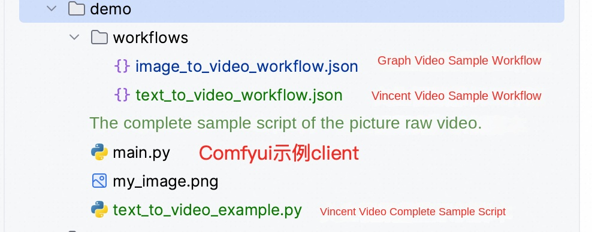

---

# ComfyUI Community Edition-Container Cluster Edition

> **Disclaimer:** This service is provided by a third party. We try our best to ensure its safety, accuracy and reliability, but we cannot guarantee that it is completely free from failures, interruptions, errors or attacks. Therefore, the company hereby declares that it makes no representations, warranties or commitments regarding the content, accuracy, completeness, reliability, suitability and timeliness of the Service and is not liable for any direct or indirect loss or damage arising from your use of the Service; for third-party websites, applications, products and services that you access through the Service, do not assume any responsibility for its content, accuracy, completeness, reliability, applicability and timeliness, and you shall bear the risks and responsibilities of the consequences of use; for any loss or damage arising from your use of this service, including but not limited to direct loss, indirect loss, loss of profits, loss of goodwill, loss of data or other economic losses, even if we have been advised in advance of the possibility of such loss or damage; we reserve the right to amend this statement from time to time, so please check this statement regularly before using the Service. If you have any questions or concerns about this Statement or the Service, please contact us.

## Overview
ComfyUI is the most powerful open source, node-based, generative AI application for creating images, video, and audio content. Relying on cutting-edge open source models can realize video and image generation.
According to the official documentation, the ComfyUI has the following characteristics:
Node/Graph/Flowchart interface for experimenting and creating complex stable diffusion workflows without writing any code.
Full support for SD1.x, SD2.x and SDXL
asynchronous queue system
Multiple optimizations re-execute only those parts of the workflow that have changed between executions.
Command line options: -- lowvram to make it run on GPUs with less than 3GB of memory (automatically enabled on GPUs with low memory)
Can be used even without GPU: -- cpu (slow)
Can load ckpt, safetensors, and diffusers models/checkpoints. Independent VAE and CLIP models.
Embedding/Text Inversion
Loras (regular, locon and loha)
Hypernetwork
Load the complete workflow from the generated PNG file (with seed
Save/load workflow as Json file.
The node interface can be used to create complex workflows, such as "Hires fix" or more advanced workflows.
Regional Synthesis
Inline using regular and Inline models.
Control network and T2I adapter
Upgrade models (ESRGAN, ESRGAN variants, SwinIR, Swin2SR, etc.)
unCLIP model
GLIGEN
Model Merge
Latent preview with TAESD
Very fast start-up.
Works completely offline: nothing is downloaded.
The configuration file sets the search path for the model.

## Prerequisites

To deploy the ComfyUI Community Edition service instance, you need to access and create some Alibaba Cloud resources. Therefore, your account must contain permissions for the following resources. **Note**: This permission is required only when your account is a RAM account.

| Permission policy name | Comment |
| ------------------------------------- | ------------------------ |
| AliyunVPCFullAccess | Permissions to manage a VPC |
| AliyunROSFullAccess | Manage permissions for Resource Orchestration Service (ROS) |
| AliyunCSFullAccess | Manage permissions for Container Service (CS) |
| AliyunComputeNestUserFullAccess | Manage user-side permissions for the compute nest service (ComputeNest) |
| AliyunOSSFullAccess | Permissions to manage Network Object Storage Service (OSS) |

## Billing Description

### Container cluster version fee

Billing method: pay by volume (hour) or package year and month
The estimated cost can be seen in real time when the instance is created.

## Overall architecture

## Deployment process

### Container cluster version deployment

1. Click [Deployment Link](https://computenest.console.aliyun.com/service/instance/create/cn-hangzhou?type=user&ServiceName=ComfyUI-ACS社区版). Fill in the parameters according to the interface prompt to see the corresponding RFQ details. After confirming the parameters, click **Next: Confirm Order**.

2. According to the situation, you can select the existing ACK and ACS clusters, or create a new ACK or ACS cluster deployment.
3. For example, select Create ACS Cluster. Default parameters can be directly selected:
4. For example, select New ACK Cluster. You need to select a worker node. Note that the node here is required and the subsequent graphics configuration has been. For example, if A10 node is selected, A10 should also be selected for subsequent GPU configuration
5. Select the model and network zone configuration you need to use.
6. Click **Next: After confirming the order**, you can also see the price preview, and then click **Deploy Now** to wait for the deployment to complete.

7. Wait for the deployment to complete before you can start using the service.

## Parameter description

| Parameter group | Parameter item | Description |
| ---------- | -------------- | ------------------------------------------------------------------ |
| Service Instance | Service Instance Name | The service instance name must be no more than 64 characters in length and must start with an English letter. It can contain numbers, English letters, dashes (-), and underscores (_). |
| | Region | The region where the service instance is deployed |
| | Billing Type | Billing type of the resource: Pay-As-You-Go and Subscription |
| Container Cluster Configuration | Cluster Specifications | Container Cluster Node Specifications |
| Network Configuration | Availability Zone | The zone where the container cluster is located |
| | VPC ID | The VPC where the resource resides |
| | VSwitch ID | VSwitch where the resource resides |

## Built-in model description

### Overview of main models

| Model Name | Type | Parameter Scale | Main Functions | Features | Applicable Scenarios |
| --------- | ------ | --------- | ---------- | ---------- | ---------- | ---------- |
| **WanX-2.1** | Multimodal video generation | I2V-14B, T2V-14B, VACE-1.3B, I2V-1.3B | Image to video/Text to video | Support multiple parameter scales, flexible configuration | Universal video generation, suitable for different performance requirements |
| **WanX-2.2** | Multimodal Video Generation | I2V-14B, T2V-14B, TI2V-5B | Image to Video/Text to Video | Upgraded Version, Performance Optimization | High Quality Video Generation |
| **Qwen-Image** | Image Generation | - | Text to Image Generation | Ali Tongyi Thousand Questions Image Model | Image Generation with Excellent Chinese Understanding |
| **WanX-2.2 Fun Camera** | Video Generation | - | Fun Camera Effects | Special Visual Effects and Filters | Creative Video Maker, Entertainment Apps |
| **WanX-2.2 Fun Control** | Video control | - | Video generation control | Precise control of video generation process | Professional video production, fine control |
| **WanX-2.2 Fun Inpaint** | Video repair | - | First and last frame repair | Intelligent completion of first and last video frames | Video post-processing and content repair |
| **WanX-2.2 S2V** | Voice to Video | - | Voice to Drive Video Generation | Generate Corresponding Video from Voice | Voice Visualization, Educational Content Production |
| **HunyuanVideo** | Video Generation | - | Mixed-element Video Generation | Tencent Mixed-element Large-model Video Version | High-quality Video Content Creation |
| **Qwen-Image-Edit** | Image editing | - | Intelligent image editing | Image editing based on natural language | Image post-processing, content modification |
| **Hunyuan3D-2.1** | 3D Generation | - | 3D Model Generation | Latest Version 3D Content Generation | 3D Modeling, Game Development |
| **Hunyuan3D-2.0** | 3D Generation | - | 3D Model Generation | 3D Content Creation | 3D Design, Virtual Reality |
| **Flux1-dev** | Image generation | - | Developer version image generation | Experimental function, highly customizable | R & D test, function verification |
| **Flux1-Krea** | Image Generation | - | Creative Image Generation | Art Style Image Generation | Art Creation, Design Work |
| **Flux1-kontext** | Image Generation | - | Context-Aware Image Generation | Intelligent Generation for Understanding Context | Continuous Content Creation, Story Illustration |
| **HunyuanImage2.1** | Image Generation | - | Mixed Image Generation 2.1 Version | Tencent Mixed Image Model Upgrade Version | High Quality Image Generation, Commercial Application |

### How to upload your own model

1. Find the deployed service instance in the computing nest console, switch Tab to the resource interface, find the resource whose product is the object storage OSS, and click Enter.
2. Access the "file list", under the path/llm-model/model for all types of models.
3. You can upload the model according to your own needs and restart the comfyui client.

## Use process

This service already has two workflows built in that you can use directly. The plugins and models involved are also ready.

### Tusheng video or Wensheng video function

1. Select the desired function in the figure below. It is recommended to choose only one to use to avoid memory explosion.
2. Select the workflow sidebar according to the instructions in the figure, select wanx-21.json and open it.
3. Select a sample picture here or choose your own local computer to upload.
4. Fill in the description at the TextEncode. The upper part is what you want to generate, and the lower part is what you don't want to generate.
5. The resolution and frame number of the picture can be set at the ImageClip Encode. This model can be set up to 720*720.
6. Other parameters can refer to official website: https://comfyui-wiki.com/zh/interface/node-options或以下文档:https://github.com/kijai/ComfyUI-WanVideoWrapper/blob/main/readme.md

PS: If you use the vace model, you can use the workflow vace.json as a reference

### Wensheng diagram function

1. Select the workflow funny_pictures.json in the workflow box.
2. Enter what you want.
3. Here you can enter some funny content, for example, I am Guan Yu vs. Snow White.
4. The resolution of the picture and the number of pictures can be set here. If you want to speed up production, you can set the batch_size to 1.
5. Wait for the image to be generated.

### Figure function

Access the template, or import your own workflow.

## API call

### API Endpoint Overview

| Endpoint | Method | Function | Description |
| ------ | ------ | ------ | ------ | ------ |
| '/queue' | GET | Get the queue status | View the current task queue |
| '/prompt' | POST | Submit Workflow | Execute Build Task |
| '/history/{prompt_id}' | GET | Obtain execution history | View task execution results |
| '/upload/image' | POST | Upload an image | Upload an input image file |
| '/view' | GET | Download the output file | Get the generated result file |

Supports public or private network API calls.
You can refer to the code to implement an API call script.

'''python
import requests
import json
import time

def run_workflow_file(workflow_file, server="http://127.0.0.1:8188"):
"" "Run Local Workflow JSON File" ""

# Load workflow
with open(workflow_file, 'r', encoding='utf-8') as f:
workflow = json.load(f)

# Submitted
response = requests.post(f"{server}/prompt", json={"prompt": workflow})
prompt_id = response.json()['prompt_id']
print(f "Task submission: {prompt_id}")

# Wait for completion
while True:
response = requests.get(f"{server}/history/{prompt_id}")
history = response.json()
if prompt_id in history:
break
print("Waiting...")
time.sleep(3)

# Download all output files
outputs = history[prompt_id]['outputs']
for node_id, node_output in outputs.items():
# Handle different types of output
for file_type in ['images', 'videos', 'gifs']:
if file_type in node_output:
for file_info in node_output[file_type]:
filename = file_info['filename']
file_url = f"{server}/view?filename={filename}&type=output"

response = requests.get(file_url)
with open(filename, 'wb') as f:
f.write(response.content)
print(f "Downloaded: {filename}")

# Use Examples
run_workflow_file("my_workflow.json")
'''

The local workflow is obtained by using the method provided in the following figure:

Since the Comfyui does not provide official API documents, here are two complete examples based on Wen Sheng video and Wen Sheng video: on how to use API to call workflow for Wen Sheng diagram or Wen Sheng video, etc.
Visit: https://github.com/aliyun-computenest/comfyui-acs/
Find the demo folder

### Wen Sheng Video API Mode

1. Open the workflow defined for confirm the good model. (The default model defined inside is the 14B's Wanxiang 2.1 Wensheng video model)
2. Confirm parameters such as Prompt and generated resolution
3. Modify the server service address in the code from 127.0.0.1 to your actual service address.
4. Local execution of python, waiting for video generation.

### Image Generation Video API

1. Open the workflow defined for confirm the good model. (The default model defined inside is the video model of 14B universal phase 2.1 map generation)
2. Confirm parameters such as Prompt and generated resolution
3. Modify the server service address in the code from 127.0.0.1 to your actual service address.
4. Local execution of python, waiting for video generation.

## Account password

The default account and password are:
1. Account number: admin
2. Password: admin

## Frequently Asked Questions

1. If a node type does not exist, install the missing node through manager and restart.