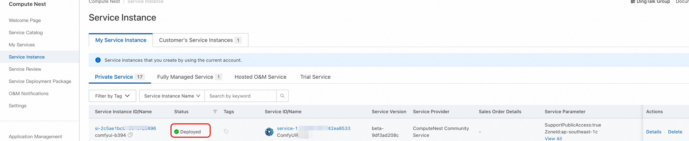

# ComfyUI Community Edition

>**Disclaimer:** This service is provided by a third party. While we strive to ensure its security, accuracy, and reliability, we cannot guarantee it is completely free from failures, interruptions, errors, or attacks. Therefore, our company hereby declares: We make no representations, warranties, or commitments regarding the content, accuracy, completeness, reliability, applicability, and timeliness of this service, and assume no responsibility for any direct or indirect losses or damages arising from your use of this service; We assume no responsibility for the content, accuracy, completeness, reliability, applicability, and timeliness of third-party websites, applications, products, and services accessed through this service - you should bear the risks and responsibilities arising from their use; We assume no responsibility for any losses or damages arising from your use of this service, including but not limited to direct losses, indirect losses, profit losses, goodwill losses, data losses, or other economic losses, even if our company has been previously informed of the possibility of such losses or damages; We reserve the right to modify this disclaimer from time to time, so please check this disclaimer regularly before using this service. If you have any questions or concerns about this disclaimer or this service, please contact us.

## Overview

ComfyUI is the most powerful open-source node-based generative AI application, supporting the creation of images, videos, and audio content. Leveraging cutting-edge open-source models, it enables video and image generation.

According to the official documentation, ComfyUI features:

+ **Node/Graph/Flowchart Interface** - Experiment and create complex Stable Diffusion workflows without writing any code
+ **Full Support** for SD1.x, SD2.x, and SDXL
+ **Asynchronous Queue System**
+ **Multiple Optimizations** - Only re-executes parts of the workflow that changed between executions
+ **Command Line Options** - `--lowvram` enables running on GPUs with less than 3GB memory (automatically enabled on low-memory GPUs)
+ **CPU Support** - Works even without GPU using `--cpu` (slower)
+ **Model Loading** - Supports ckpt, safetensors, and diffusers models/checkpoints. Standalone VAE and CLIP models
+ **Embeddings/Textual Inversion**
+ **LoRAs** (regular, locon, and loha)
+ **Hypernetworks**
+ **Workflow Loading** - Load complete workflows from generated PNG files (including seeds)
+ **JSON Export/Import** - Save/load workflows as JSON files
+ **Complex Workflows** - Node interface for creating complex workflows like "Hires fix" or more advanced workflows
+ **Area Composition**
+ **Inpainting** - Using regular and inpainting models
+ **ControlNet and T2I Adapters**
+ **Upscaling Models** (ESRGAN, ESRGAN variants, SwinIR, Swin2SR, etc.)
+ **unCLIP Models**
+ **GLIGEN**
+ **Model Merging**
+ **Latent Previews** using TAESD
+ **Fast Startup**
+ **Fully Offline** - Downloads nothing
+ **Configuration Files** for setting model search paths

## Prerequisites

Deploying the ComfyUI Community Edition service instance requires access and creation permissions for certain Alibaba Cloud resources. Therefore, your account needs permissions for the following resources. **Note**: These permissions are only required when your account is a RAM account.

| **Permission Policy Name** | **Description** |
|---------------------------|-----------------|
| AliyunECSFullAccess | Permission to manage Elastic Compute Service (ECS) |
| AliyunVPCFullAccess | Permission to manage Virtual Private Cloud (VPC) |
| AliyunROSFullAccess | Permission to manage Resource Orchestration Service (ROS) |
| AliyunComputeNestUserFullAccess | User-side permission to manage Compute Nest Service |

## Billing Information

The costs for deploying the Community Edition on Compute Nest mainly include:

+ **Selected vCPU and memory specifications**
+ **System disk type and capacity**
+ **Public network bandwidth**

## Parameter Description

| **Parameter Group** | **Parameter** | **Description** |
|-------------------|---------------|-----------------|
| Service Instance | Service Instance Name | Maximum 64 characters, must start with an English letter, can include numbers, English letters, hyphens (-), and underscores (_) |
| | Region | Region where the service instance is deployed |
| | Payment Type | Billing type for resources: Pay-as-you-go and Subscription |
| ECS Instance Configuration | Instance Type | Available instance specifications in the availability zone |
| Network Configuration | Availability Zone | Availability zone where the ECS instance is located |
| | VPC ID | VPC where resources are located |
| | Switch ID | Switch where resources are located |

## Deployment Process

1. **Access Compute Nest** [deployment link](https://computenest.console.aliyun.com/service/instance/create/ap-southeast-1?type=user&ServiceId=service-11cf4eb33d1442ea8533) and fill in deployment parameters as prompted

2. **Fill in instance parameters** and select your desired purchase method and instance type
   

3. **Important Note**: If you want to use image-to-video functionality, to reduce the possibility of RAM overflow, please select memory specifications of 60GB or higher + A10 or higher GPU specifications

4. **Configure network settings** - Choose to create a new dedicated network or use an existing VPC. Fill in availability zone and network parameters
   

5. **Create instance** - Click "Create Now" and wait for service instance deployment to complete

6. **Access instance details** - After deployment completion, click the instance ID to enter the details interface
   

7. **Access service** - Visit the service instance's usage URL. We use secure proxy for direct access to prevent your data from being exposed to the public network
   

8. **Enter ComfyUI interface**

## Usage Guide

This service comes with two pre-configured workflows ready for immediate use, with all necessary plugins and models already prepared.

### Image-to-Video or Text-to-Video Functionality

1. **Select desired functionality** at the location shown below. We recommend selecting only one to avoid memory overflow
   

2. **Load workflow** - Follow the guide to select the workflow sidebar, choose `wans.json` and open it
   

3. **Upload image** - Select a sample image or upload from your local computer
   

4. **Enter prompts** - Fill in description text in TextEncode. The upper section is for content you want to generate, the lower section is for content you don't want
   

5. **Configure settings** - In ImageClip Encode, you can set image resolution and frame count. This model supports up to 720×720 resolution
   

6. **Additional parameters** can be referenced from the official website: https://comfyui-wiki.com/zh/interface/node-options or documentation: https://github.com/kijai/ComfyUI-WanVideoWrapper/blob/main/readme.md

### Text-to-Image Functionality

1. **Select workflow** in the workflow frame
   

2. **Input your desired content**
   

3. **Creative examples** - You can input creative content, such as "Guan Yu battles Snow White"

4. **Configure output settings** - Set image resolution and quantity here. To speed up generation, set batch_size to 1
   

5. **Wait for generation** - Allow time for image generation to complete

### Image-to-Image Functionality

Access templates or import your own workflows for use

## Model Downloads

1. **Recommended source**: ModelScope (魔搭)
2. **Model storage path**: `/root/storage/models`

## Account Credentials

Default username and password:
- **Username**: admin
- **Password**: admin

## Frequently Asked Questions

1. **Missing node types**: If you encounter "node type does not exist" errors, install missing nodes through the manager and restart
   
   

---

*This documentation provides comprehensive guidance for deploying and using ComfyUI Community Edition on Alibaba Cloud's Compute Nest platform.*